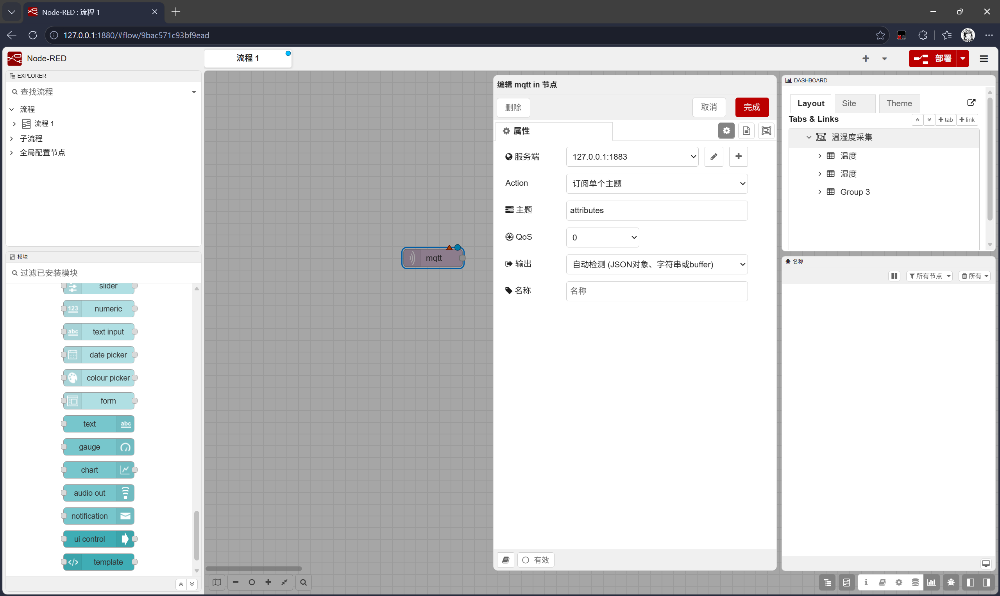
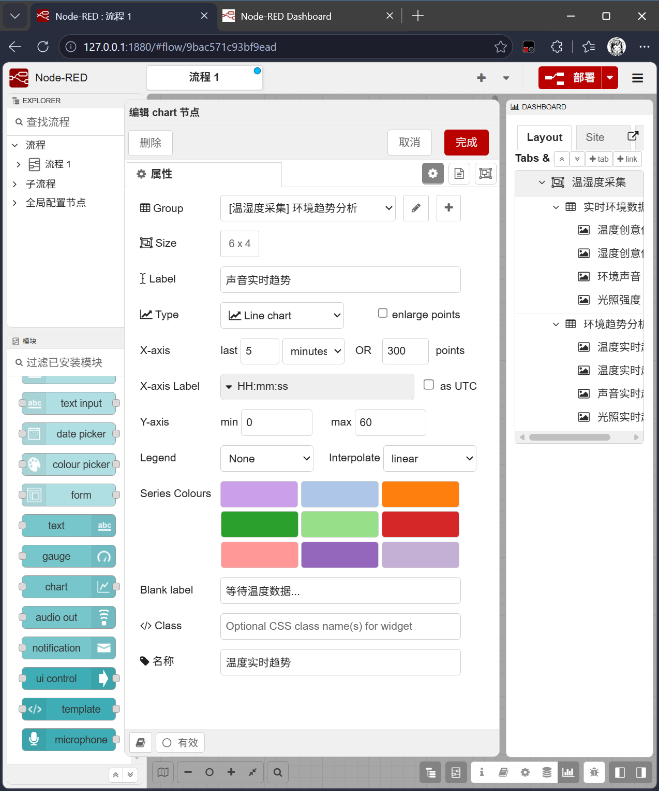

# MQTT、EMQX 与 Node-RED 环境监测

## 一、今天的项目目标

今天把实践箱中的 DHT11、光敏传感器和声音传感器接入一条 IoT 数据链路：Python 采集四项环境数据，将它们合成一条 MQTT JSON 消息，经 EMQX 转交给 Node-RED，最后在 Dashboard 中显示实时状态和变化趋势。

对应示例：

- [14_mqtt_environment_publisher.py](../examples/14_mqtt_environment_publisher.py)
- [15_node_red_parse_environment.js](../examples/15_node_red_parse_environment.js)

整体流程：

```text
DHT11 / 光敏 / 声音传感器
          -> Arduino + FirmataExpress
          -> pymata4EX Python 程序
          -> MQTT publish: attributes
          -> EMQX Broker (127.0.0.1:1883)
          -> Node-RED MQTT in
          -> Function 拆成四路
          -> Dashboard 卡片、仪表盘、趋势图
```

## 二、先分清两种项目路线

上一节的蓝牙 GUI 作业中，Arduino 运行的是自行编写的采集程序，电脑端用 `pyserial` 接收蓝牙串口数据。今天的项目则回到课程的 FirmataExpress + `pymata4EX` 工作方式：Arduino 由 FirmataExpress 固件接管，Python 可以直接调用 `dht_read()` 和 `analog_read()`。

这两种路线使用的 Arduino 程序不同。切换到今天的 MQTT 项目前，应确认板子已烧录 FirmataExpress；如果板子仍运行自定义蓝牙采集程序，`pymata4EX.Pymata4EX()` 可能找不到 FirmataExpress。

| 项目路线 | Arduino 端 | Python 端 | 主要用途 |
| --- | --- | --- | --- |
| 蓝牙环境 GUI | 自定义采集程序 | `pyserial` + PyQt5 | 电脑本地上位机 |
| MQTT + Node-RED | FirmataExpress | `pymata4EX` + `paho-mqtt` | IoT Dashboard |

## 三、硬件与采集数据

今天沿用实践箱的接线：DHT11 在 D2，光敏传感器在 A0，声音传感器在 A1。在 `pymata4EX` 中，A0 和 A1 使用模拟通道编号 `0`、`1`。

```python
DHT_PIN = 2
LIGHT_PIN = 0
SOUND_PIN = 1

board.set_pin_mode_dht(DHT_PIN, sensor_type=11)
board.set_pin_mode_analog_input(LIGHT_PIN)
board.set_pin_mode_analog_input(SOUND_PIN)
```

`board.dht_read(DHT_PIN)` 的课程示例返回值中，`value[0]` 是湿度，`value[1]` 是温度。模拟读取 `board.analog_read(pin)[0]` 得到的是 ADC 原始数值，通常范围为 `0` 到 `1023`。

声音和光照在本项目中应写为“声音传感器原始值（ADC）”和“光线传感器原始值（ADC）”，不应直接标成分贝 `dB` 或照度 `lux`。要显示真实物理单位，后续还需要按具体传感器型号进行标定。

## 四、一次发布一条 JSON

Python 不分别发送温度、湿度、声音、光照四次，而是每次采集后组合成一个字典，再发布一条 JSON：

```python
data = {
    "temperature": temperature,
    "humidity": humidity,
    "sound": sound,
    "light": light,
}

payload = json.dumps(data, ensure_ascii=False, separators=(",", ":"))
client.publish("attributes", payload)
```

例如：

```json
{"temperature":28.1,"humidity":52.0,"sound":410,"light":387}
```

这种做法让同一次采集的四项数据保持在同一条消息中，也让 Node-RED 只需订阅一个主题 `attributes`。

## 五、MQTT、EMQX 与三个端口

| 地址或端口 | 用途 | 不要混淆为 |
| --- | --- | --- |
| `127.0.0.1:1883` | EMQX 的 MQTT Broker，供 Python 与 Node-RED 连接 | Node-RED 页面 |
| `127.0.0.1:1880` | Node-RED 编辑器与 Dashboard 页面 | MQTT Broker |
| `127.0.0.1:18083` | EMQX 管理后台网页 | MQTT 客户端端口 |

Python 与 Node-RED 的 MQTT in 节点都应使用 `127.0.0.1:1883`，Topic 必须完全一致地写成 `attributes`。如果课程环境未设置 MQTT 客户端认证，用户名、密码保持空白；EMQX 管理后台的网页登录账号并不是 MQTT 客户端账号。

Python 使用 `client.loop_start()` 维持 MQTT 网络循环，退出时用 `loop_stop()` 和 `disconnect()` 释放连接。需要的额外库是：

```powershell
python -m pip install paho-mqtt
```

## 六、Node-RED 的四路 Function

在 Function 节点中将 `Outputs` 设置为 `4`，输出顺序固定为：

1. 温度
2. 湿度
3. 声音原始值
4. 光线原始值

示例 [15_node_red_parse_environment.js](../examples/15_node_red_parse_environment.js) 兼容 MQTT in 传来的 Buffer、JSON 字符串和对象三种情况，并校验四个字段是否齐全、是否为有限数值。成功后，每一路都把纯数值放在 `msg.payload`，因此可以直接连接到 Dashboard 节点。

```text
attributes MQTT in
        -> 解析环境数据 Function
        -> 输出 1: 温度 -> 温度卡片、温度趋势图
        -> 输出 2: 湿度 -> 湿度卡片、湿度趋势图
        -> 输出 3: 声音 -> 声音 Gauge、声音趋势图
        -> 输出 4: 光线 -> 光线 Gauge、光线趋势图
```

一个 Function 输出可以同时连到多个节点，这是正常用法。解析失败时，Function 用 `node.warn()` 在 Debug 面板留下原因，并向四个输出返回 `null`，避免错误数据进入仪表盘。

## 七、Dashboard 排布

在 Dashboard 的 Layout 中建立两个宽度均为 `12` 的 Group：

- `实时环境数据`
- `环境趋势分析`

每一行放两个宽度为 `6` 的组件，Dashboard 会按“从左到右、从上到下”排列。

| Group | 顺序 | 节点 | 建议尺寸 |
| --- | --- | --- | --- |
| 实时环境数据 | 1 | 温度创意仪表盘 Template | `6 x 5` |
| 实时环境数据 | 2 | 湿度创意仪表盘 Template | `6 x 5` |
| 实时环境数据 | 3 | 环境声音 Gauge，范围 `0-1023`，单位 `ADC` | `6 x 4` |
| 实时环境数据 | 4 | 光照强度 Gauge，范围 `0-1023`，单位 `ADC` | `6 x 4` |
| 环境趋势分析 | 1 | 温度实时趋势，范围 `0-60` | `6 x 4` |
| 环境趋势分析 | 2 | 湿度实时趋势，范围 `0-100` | `6 x 4` |
| 环境趋势分析 | 3 | 声音实时趋势，范围 `0-1023` | `6 x 4` |
| 环境趋势分析 | 4 | 光照实时趋势，范围 `0-1023` | `6 x 4` |

四张 Chart 的通用设置：Line chart、最近 `5 minutes` 或 `300 points`、X 轴标签 `HH:mm:ss`、不勾选 UTC、不放大数据点、Legend 选 None、插值选 linear。颜色可用温度橙红、湿度蓝、声音紫、光照黄橙，便于展示时区分。

课堂操作截图：





## 八、分层排查顺序

不要直接从 Dashboard 猜问题。按数据流逐层检查，能很快确定故障位置：

1. 运行 Python，确认终端持续打印 `已发布: {...}`，且四个字段都有数值。
2. 在 EMQX 中确认 Python 发布端和 Node-RED 订阅端都已连接；Node-RED 接入后应能看到 `attributes` 的订阅。
3. 检查 Node-RED MQTT in：服务器是 `127.0.0.1:1883`、Topic 是 `attributes`、状态应为已连接。
4. 将 MQTT in 接到第一个 Debug，确认收到完整 JSON。
5. 将 Function 的四个输出分别接 Debug，确认每个 `msg.payload` 都是对应的纯数值。
6. 最后检查 Dashboard 节点的 Group、连线和是否点击了“部署”。实际页面地址为 `http://127.0.0.1:1880/ui`，不是编辑器中的 `/#flow/...` 地址。

这条排查链把问题分为“硬件采集、MQTT 发布、MQTT 订阅、JSON 解析、页面展示”五层。前一层没有通过时，先不要改后一层。

## 九、按软件完成一次项目

下面按实际操作顺序完成一遍。第一次搭建时，建议先只连到 Node-RED 的 Debug，确认数据链路通了，再添加卡片、Gauge 和 Chart。

### 1. Arduino IDE：烧录 FirmataExpress

1. 用 USB 连接 Arduino，并在 Arduino IDE 中选择正确的开发板型号与串口。
2. 打开课程要求的 `FirmataExpress` 示例；不同安装包的菜单位置可能不同，但示例名称应为 `FirmataExpress`。
3. 点击“上传”，等待底部显示上传完成。
4. 不要让 Arduino 同时运行此前蓝牙 GUI 作业的自定义采集程序。今天的 Python 程序依赖 FirmataExpress；切换项目时需要重新烧录相应程序。
5. 接好 DHT11 的 D2、光敏传感器的 A0、声音传感器的 A1，再关闭可能占用 Arduino 串口的串口监视器。

### 2. PyCharm：运行 Python 采集与发布端

1. 在 PyCharm 打开课程项目根目录，例如 `zhihuichengshi`；`mqtt_dht11.py` 应放在根目录，不能放进 `MyClass` 文件夹。
2. 在底部 Terminal 执行以下命令，为当前解释器安装 MQTT 库：

   ```powershell
   python -m pip install paho-mqtt
   ```

3. 打开 `dht11_mqtt.py`，核对 `DHT_PIN = 2`、`LIGHT_PIN = 0`、`SOUND_PIN = 1`，以及 `MQTT_HOST = "127.0.0.1"`、`MQTT_PORT = 1883`、`MQTT_TOPIC = "attributes"`。
4. 右键文件并选择 Run，或点击绿色运行按钮。正常时会重复打印：

   ```text
   已发布: {"temperature":28.1,"humidity":52.0,"sound":410,"light":387}
   ```

5. 用手遮住光敏传感器、在声音传感器附近制造声音，观察 `light` 和 `sound` 是否变化。若这一步没有变化，先检查传感器、接线和 FirmataExpress，不要先修改 Node-RED。
6. 需要停止时，在 Run 窗口点击停止按钮，或在终端按 `Ctrl+C`；程序会停止 MQTT 并关闭开发板连接。

### 3. EMQX：确认消息中转服务

1. 在浏览器打开 `http://127.0.0.1:18083`，这是 EMQX 的管理后台。
2. 登录后查看客户端、主题或订阅信息。管理后台登录只用于查看和管理 EMQX，不等于 MQTT in 节点的用户名和密码。
3. 先运行 Python，再部署 Node-RED。正常情况下会有至少两个 MQTT 客户端：Python 负责发布，Node-RED 负责订阅。
4. 若 Python 报 `ConnectionRefusedError` 或 `WinError 10061`，检查 EMQX 是否已启动，以及是否正在监听 `127.0.0.1:1883`。

### 4. Node-RED：订阅、解析并分发数据

1. 打开 `http://127.0.0.1:1880`，这是 Node-RED 编辑器。
2. 从左侧拖入 `mqtt in` 节点，双击配置：服务器填 `127.0.0.1:1883`，Topic 填 `attributes`，QoS 选 `0`。未启用客户端认证时，用户名与密码留空，Client ID 也留空以自动生成。
3. 拖入 Function 节点，命名为“解析环境数据”，将 Outputs 设置为 `4`。把 [15_node_red_parse_environment.js](../examples/15_node_red_parse_environment.js) 的内容粘贴到 Function 代码框。
4. 先给 MQTT in 和 Function 的四个输出各接一个 Debug 节点。部署后，Debug 面板应依次看到完整 JSON，以及温度、湿度、声音、光线四个数值。
5. Function 输出 1 接温度 Template 与温度 Chart；输出 2 接湿度 Template 与湿度 Chart；输出 3 接声音 Gauge 与声音 Chart；输出 4 接光照 Gauge 与光照 Chart。
6. 每次改完节点配置或连线，都点击右上角“部署”。紫色 MQTT in 节点显示“已连接”后，才表示 Node-RED 已连接到 EMQX。

### 5. Node-RED Dashboard：安排页面组件

1. 在右侧 Dashboard 的 Layout 中创建两个 Group：`实时环境数据` 和 `环境趋势分析`，宽度都设为 `12`。
2. 在“实时环境数据”中按顺序放入温度 Template、湿度 Template、声音 Gauge、光照 Gauge。温湿度 Template 建议 `6 x 5`，两个 Gauge 建议 `6 x 4`。
3. 在“环境趋势分析”中依次放入温度、湿度、声音、光照四张 Chart，全部设为 `6 x 4`。四张 Chart 共用 Line chart、最近 5 minutes、300 points、`HH:mm:ss`、linear；Y 轴范围依次是 `0-60`、`0-100`、`0-1023`、`0-1023`。
4. 打开 `http://127.0.0.1:1880/ui` 查看最终页面；这是 Dashboard 页面，而不是编辑器地址中的 `/#flow/...`。
5. 页面没有更新时，先点击“部署”，再在 Dashboard 页面按 `Ctrl+F5` 强制刷新；然后按照本笔记“分层排查顺序”逐层检查。

## 十、今天新增知识点

| 知识点 | 作用 |
| --- | --- |
| FirmataExpress | 让 Python 通过 `pymata4EX` 访问 Arduino 引脚 |
| `paho-mqtt` | Python MQTT 客户端库 |
| MQTT Topic | 发布者和订阅者约定的消息通道，例如 `attributes` |
| EMQX | MQTT Broker，负责转发消息 |
| JSON | 将多项传感器数据打包为一条结构化消息 |
| Node-RED MQTT in | 订阅 MQTT Topic 并接收消息 |
| Function 节点 | 用 JavaScript 校验、解析和分发数据 |
| Dashboard Group | 控制组件的分区、顺序与栅格布局 |
| Gauge / Chart / Template | 分别显示当前数值、历史趋势和自定义卡片 |
| ADC 原始值 | 传感器未经物理标定的 `0-1023` 采样结果 |

## 十一、课堂总结

今天的核心不是某一个传感器，而是从硬件采集到可视化的完整 IoT 链路：传感器负责感知，Python 负责采集和发布，EMQX 负责消息转发，Node-RED 负责低代码处理和展示。这个结构可以继续扩展新的传感器或控制节点，而不必推倒现有 Dashboard。
